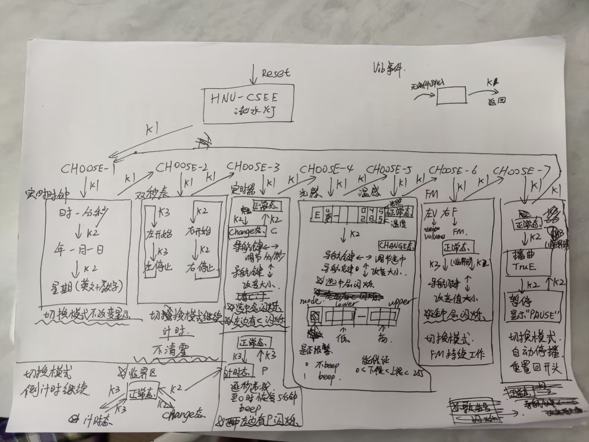

# HNU-STC_project
## 简单介绍

A project using STC-B in HNU Summer2023, an interesting project

下面是该STC版的使用说明书

该目录路径下：

- Project_BSP_old_version
- Project_pc：项目-PC端引导程序
- Project_STC：项目-STC-BSP工程文件
- Project_STC_old_version：项目旧版本
- TruE独享版（播放TruE音乐）：只播放崩坏三的《TruE》音乐
- 图标：STC的OLED中使用的图标原图
- 参考资料：
- OLED 补充资料：

## 如何开始

### 单片机

使用单片机开发软件KEILμVision，打开Project_STC编译，使用串口工具下载进单片机，即可开始工作。

### PC端引导程序

打开Project_pc文件夹，运行python文件，请注意依赖可能需要自行下载。

请注意，运行PC端引导程序需要维持串口通信（即您的单片机需要连接在电脑上），而维持单片机运行则仅仅需要将程序下载至单片机并维持单片机通电即可。

## 详细信息

可以在<基于STC板的智能模型（提交电子版）.pdf>中找到。

## 写在后面

祝你享受与STC板相处的日子。

如果喜欢本仓库，麻烦点个star与follow。

个人主页：https://wolfvoid.github.io/

欢迎友链与联系。
